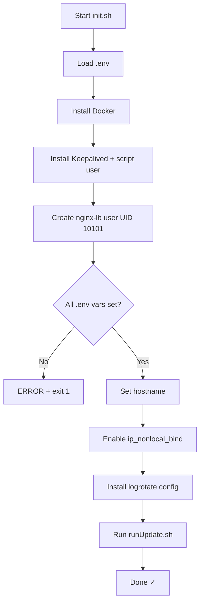

# `init.sh` — One-Time Initialisation Script

> **Purpose:** Bootstrap a fresh Linux host into a fully operational CyberArk load-balancer node (primary or backup). This script is designed to be run **once** on each host.

---

## Full Source Reference

```bash
#!/bin/env bash

set -e

# Load environment variables
set -a
source "$(dirname "$0")/.env"
set +a

# installing docker:
curl -fsSL https://get.docker.com | sh
sudo usermod -aG docker $USER

# install keepalived
sudo apt install -y keepalived
sudo useradd -r -s /sbin/nologin keepalived_script 2>/dev/null || true

# Create a dedicated user for the nginx container
sudo groupadd -g 10101 nginx-lb 2>/dev/null || true
sudo useradd -r -u 10101 -g 10101 -s /sbin/nologin nginx-lb 2>/dev/null || true

# Validate .env variables
for var in NODE_ROLE DATAPLANE_VIP DATAPLANE_IP_PRIMARY DATAPLANE_IP_BACKUP \
           PVWA_UPSTREAM_1 PVWA_UPSTREAM_2 PSM_UPSTREAM_1 PSM_UPSTREAM_2 \
           PSMP_UPSTREAM_1 PSMP_UPSTREAM_2; do
    if [ -z "${!var}" ]; then
        echo "ERROR: $var is not set in .env"
        exit 1
    fi
done

# Set hostname based on node role
case "$NODE_ROLE" in
  primary) sudo hostnamectl set-hostname cyberark-lb-primary ;;
  backup)  sudo hostnamectl set-hostname cyberark-lb-backup  ;;
  *)
    echo "ERROR: NODE_ROLE must be 'primary' or 'backup' in .env"
    exit 1
    ;;
esac

# Allow Docker to bind to the VIP even if this node is currently the BACKUP
sudo sysctl -w net.ipv4.ip_nonlocal_bind=1
grep -q 'net.ipv4.ip_nonlocal_bind=1' /etc/sysctl.conf || \
    echo "net.ipv4.ip_nonlocal_bind=1" | sudo tee -a /etc/sysctl.conf > /dev/null

# Install logrotate configuration
sudo cp "$(pwd)/cyberark-nginx" /etc/logrotate.d/cyberark-nginx
sudo chmod 644 /etc/logrotate.d/cyberark-nginx
sudo chown root:root /etc/logrotate.d/cyberark-nginx

# Render configs and start services
chmod +x ./runUpdate.sh
./runUpdate.sh
```

---

## Line-by-Line Walkthrough

### Shebang and Error Handling

```bash
#!/bin/env bash
set -e
```

| Line | What it does |
|---|---|
| `#!/bin/env bash` | Uses the env-based shebang so `bash` is located via `$PATH` rather than hard-coded. |
| `set -e` | **Exit on first error.** Any command returning a non-zero exit code will immediately abort the script. This prevents partial initialisation. |

---

### Loading Environment Variables

```bash
set -a
source "$(dirname "$0")/.env"
set +a
```

| Line | What it does |
|---|---|
| `set -a` | Turns on **auto-export mode** — every variable assigned from this point onwards is automatically `export`ed into the environment. |
| `source "$(dirname "$0")/.env"` | Reads the `.env` file located in the **same directory as the script** (not necessarily the current working directory). `dirname "$0"` resolves to the script's directory. All key-value pairs become environment variables. |
| `set +a` | Turns auto-export mode **off** again to avoid accidentally exporting any later variable assignments. |

**Why is this needed?** The variables loaded here (`NODE_ROLE`, `DATAPLANE_VIP`, upstream IPs, etc.) are consumed by the validation block below, by `envsubst` inside `runUpdate.sh`, and by `docker-compose.yml`.

---

### Installing Docker

```bash
curl -fsSL https://get.docker.com | sh
sudo usermod -aG docker $USER
```

| Line | What it does |
|---|---|
| `curl -fsSL https://get.docker.com \| sh` | Downloads Docker's official convenience install script and pipes it to `sh`. The flags mean: `-f` fail silently on HTTP errors, `-s` silent mode, `-S` show errors even in silent mode, `-L` follow redirects. |
| `sudo usermod -aG docker $USER` | Adds the **current user** to the `docker` group so they can run Docker commands without `sudo` in future sessions. (Note: a re-login is needed for this to take effect.) |

---

### Installing Keepalived

```bash
sudo apt install -y keepalived
sudo useradd -r -s /sbin/nologin keepalived_script 2>/dev/null || true
```

| Line | What it does |
|---|---|
| `sudo apt install -y keepalived` | Installs the Keepalived package using APT. `-y` auto-confirms the installation. |
| `sudo useradd -r -s /sbin/nologin keepalived_script 2>/dev/null \|\| true` | Creates a **system user** (`-r`) named `keepalived_script` with no login shell. This user is referenced in `keepalived.conf` as the `script_user` — the health-check script runs under this unprivileged account for security. `2>/dev/null \|\| true` suppresses the error if the user already exists and prevents `set -e` from aborting. |

---

### Creating the Nginx Container User

```bash
sudo groupadd -g 10101 nginx-lb 2>/dev/null || true
sudo useradd -r -u 10101 -g 10101 -s /sbin/nologin nginx-lb 2>/dev/null || true
```

| Line | What it does |
|---|---|
| `groupadd -g 10101 nginx-lb` | Creates a system group with GID **10101**. |
| `useradd -r -u 10101 -g 10101 -s /sbin/nologin nginx-lb` | Creates a system user with UID **10101**, belonging to the group above. |

**Why UID 10101?** The official Nginx Docker image defaults to UID 101, which on Debian/Ubuntu collides with the `messagebus` system user. Using 10101 avoids the clash. The `docker-compose.yml` runs the container as `user: "10101:10101"` and the log/cache directories are owned by this UID.

---

### Validating Environment Variables

```bash
for var in NODE_ROLE DATAPLANE_VIP DATAPLANE_IP_PRIMARY DATAPLANE_IP_BACKUP \
           PVWA_UPSTREAM_1 PVWA_UPSTREAM_2 PSM_UPSTREAM_1 PSM_UPSTREAM_2 \
           PSMP_UPSTREAM_1 PSMP_UPSTREAM_2; do
    if [ -z "${!var}" ]; then
        echo "ERROR: $var is not set in .env"
        exit 1
    fi
done
```

| Element | What it does |
|---|---|
| `for var in ...` | Iterates over every required variable name. |
| `${!var}` | **Indirect expansion** — evaluates the variable whose name is stored in `$var`. For example, when `var=NODE_ROLE`, `${!var}` expands to the value of `$NODE_ROLE`. |
| `-z` test | Returns true if the variable's value is an **empty string** (i.e., it was not set in `.env`). |
| `exit 1` | Aborts with a non-zero exit code so the operator knows exactly which variable is missing. |

This is a **fail-fast guard**: if any required variable is absent, the script stops before making any system changes.

---

### Setting the Hostname

```bash
case "$NODE_ROLE" in
  primary) sudo hostnamectl set-hostname cyberark-lb-primary ;;
  backup)  sudo hostnamectl set-hostname cyberark-lb-backup  ;;
  *)
    echo "ERROR: NODE_ROLE must be 'primary' or 'backup' in .env"
    exit 1
    ;;
esac
```

| Element | What it does |
|---|---|
| `case "$NODE_ROLE" in` | Pattern-matching on the node role value. |
| `hostnamectl set-hostname ...` | Permanently sets the system hostname. Makes it easy to identify which node you're on when SSH'ed in. |
| `*) ... exit 1` | Catch-all: if `NODE_ROLE` is anything other than `primary` or `backup`, the script aborts with an error. |

---

### Enabling Non-Local Bind

```bash
sudo sysctl -w net.ipv4.ip_nonlocal_bind=1
grep -q 'net.ipv4.ip_nonlocal_bind=1' /etc/sysctl.conf || \
    echo "net.ipv4.ip_nonlocal_bind=1" | sudo tee -a /etc/sysctl.conf > /dev/null
```

| Line | What it does |
|---|---|
| `sysctl -w net.ipv4.ip_nonlocal_bind=1` | **Immediately** allows processes to bind to IP addresses that are not (yet) assigned to any local interface. This is critical because the Docker container binds to the VIP, but the VIP only exists on the node that currently holds it. Without this setting, Docker would refuse to start on the backup node. |
| `grep -q ... \|\| echo ...` | Makes the setting **persistent** across reboots by appending it to `/etc/sysctl.conf` — but only if it isn't already there (idempotent). |

---

### Installing the Logrotate Configuration

```bash
sudo cp "$(pwd)/cyberark-nginx" /etc/logrotate.d/cyberark-nginx
sudo chmod 644 /etc/logrotate.d/cyberark-nginx
sudo chown root:root /etc/logrotate.d/cyberark-nginx
```

| Line | What it does |
|---|---|
| `cp ... /etc/logrotate.d/` | Copies the logrotate snippet (the `cyberark-nginx` file) into the system's logrotate drop-in directory. |
| `chmod 644` | Sets read/write for owner, read-only for group and others — the standard permission for logrotate configs. |
| `chown root:root` | Ensures ownership is `root:root`, which logrotate requires. |

---

### Handing Off to `runUpdate.sh`

```bash
chmod +x ./runUpdate.sh
./runUpdate.sh
```

| Line | What it does |
|---|---|
| `chmod +x` | Ensures the update script is executable. |
| `./runUpdate.sh` | Delegates the actual config rendering and service start-up to `runUpdate.sh`. See [runUpdate.sh documentation](runupdate-sh.md) for details. |

---

## Execution Flow Summary


