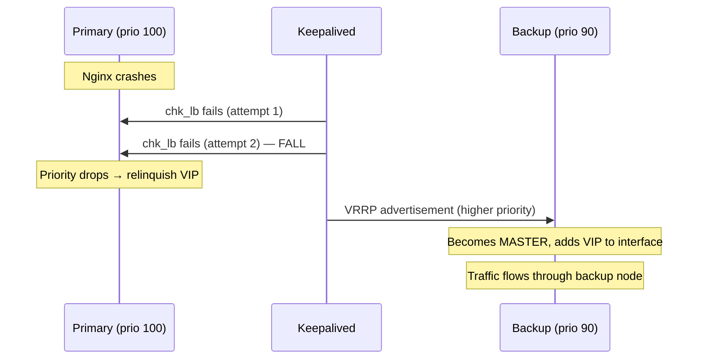

# Keepalived Configuration — Primary & Backup

> **Purpose:** Keepalived manages a **Virtual IP (VIP)** shared between two nodes using VRRP (Virtual Router Redundancy Protocol). If the active node's Nginx health check fails, the VIP automatically floats to the other node.

---

## Architecture

```
┌──────────────────────┐       VRRP (unicast)       ┌──────────────────────┐
│   Primary Node       │ ◄────────────────────────► │   Backup Node        │
│   priority: 100      │                            │   priority: 90       │
│   state: BACKUP      │                            │   state: BACKUP      │
│                      │                            │                      │
│   VIP: held here     │  ── on failure ──►         │   VIP: floats here   │
│   when healthy       │                            │   on failover        │
└──────────────────────┘                            └──────────────────────┘
```

> **Both** nodes start in `state BACKUP` with `nopreempt`. The node with the higher priority wins the initial election. This avoids split-brain and unnecessary VIP flapping.

---

## `keepalived.conf.primary` — Detailed Walkthrough

### Global Definitions

```
global_defs {
    vrrp_strict off
    enable_script_security
    script_user keepalived_script
}
```

| Directive | What it does |
|---|---|
| `vrrp_strict off` | Disables strict VRRP compliance mode. Strict mode blocks features like unicast peers, which this config relies on. |
| `enable_script_security` | Only allows scripts to run that are owned by root or the configured `script_user`, preventing privilege escalation. |
| `script_user keepalived_script` | The health-check script runs as the unprivileged `keepalived_script` user (created by `init.sh`). |

### Health Check Script

```
vrrp_script chk_lb {
    script "/usr/bin/nc -zvw 1 172.20.0.10 8443"
    timeout 2
    interval 3
    fall 2
    rise 2
}
```

| Directive | What it does |
|---|---|
| `script "..."` | Runs `nc` (netcat) to attempt a TCP connection to the Nginx container at `172.20.0.10:8443`. This is the Docker bridge IP of the container. `-z` scan only (no data), `-v` verbose, `-w 1` timeout after 1 second. |
| `timeout 2` | If the script doesn't return within **2 seconds**, it's considered failed. |
| `interval 3` | Run the health check every **3 seconds**. |
| `fall 2` | Mark the service as **down** after **2 consecutive failures** (= 6 seconds). |
| `rise 2` | Mark the service as **up** after **2 consecutive successes** (= 6 seconds). |

**Why port 8443?** Port 8443 is the PVWA listener inside the container. If Nginx is healthy and accepting connections, port 8443 will respond to a TCP handshake.

**Why 172.20.0.10?** This is the static IP assigned to the Nginx container within the Docker bridge network (defined in `docker-compose.yml`). The health check runs on the host, reaching into the container network.

### VRRP Instance

```
vrrp_instance VI_1 {
    state BACKUP
    interface eth0
    virtual_router_id 69
    priority 100
    nopreempt

    unicast_src_ip ${DATAPLANE_IP_PRIMARY}
    unicast_peer {
        ${DATAPLANE_IP_BACKUP}
    }

    track_script {
        chk_lb
    }

    virtual_ipaddress {
        ${DATAPLANE_VIP}/24
    }
}
```

| Directive | What it does |
|---|---|
| `state BACKUP` | Initial state. Both nodes start as BACKUP and elect a master based on priority. This is safer than starting one as MASTER. |
| `interface eth0` | The network interface where the VIP will be added. Change this if your data-plane interface has a different name (e.g., `ens192`). |
| `virtual_router_id 69` | Unique identifier for this VRRP group. Both nodes **must** use the same ID. Must be unique on the L2 segment (1–255). |
| `priority 100` | **Primary** gets 100, **backup** gets 90. Higher priority wins the election. |
| `nopreempt` | Once a node becomes master, it **stays** master even if the original primary recovers. Prevents VIP flapping. Requires both nodes to start in `state BACKUP`. |
| `unicast_src_ip` | This node's real IP for VRRP communication. |
| `unicast_peer { ... }` | The other node's real IP. Using **unicast** instead of multicast avoids issues on cloud networks that block multicast. |
| `track_script { chk_lb }` | Ties the VRRP instance to the health check. If `chk_lb` fails, this node's effective priority drops to 0, causing a failover. |
| `virtual_ipaddress { ... }` | The VIP that Keepalived manages. Added to the interface when this node is master, removed when it's backup. |

---

## `keepalived.conf.backup` — Differences

The backup template is nearly identical with these key differences:

| Directive | Primary | Backup |
|---|---|---|
| `priority` | `100` | `90` |
| `unicast_src_ip` | `${DATAPLANE_IP_PRIMARY}` | `${DATAPLANE_IP_BACKUP}` |
| `unicast_peer` | `${DATAPLANE_IP_BACKUP}` | `${DATAPLANE_IP_PRIMARY}` |

Everything else (global_defs, vrrp_script, virtual_router_id, nopreempt, track_script, virtual_ipaddress) is identical.

---

## Failover Timeline



**Total failover time:** ~6–9 seconds (2 × 3s interval for `fall 2`, plus VRRP advertisement delay).

---

## Customisation Notes

- **Interface name**: If your host uses `ens192`, `ens160`, or another name instead of `eth0`, you must edit both `keepalived.conf.primary` and `keepalived.conf.backup` templates.
- **Virtual Router ID**: Must match on both nodes. Change from `69` only if there's a conflict with another VRRP group on the same network segment.
