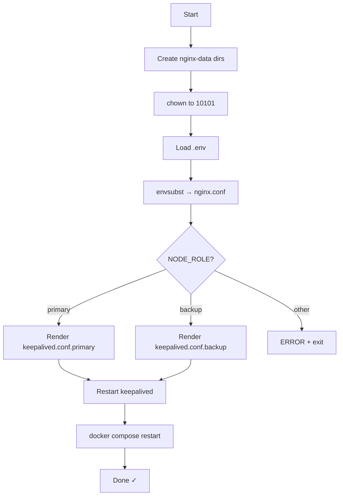

# `runUpdate.sh` — Config Renderer & Service Restarter

> **Purpose:** Re-render the Nginx and Keepalived configuration files from their templates using current `.env` values, then restart both services. Idempotent and safe to run repeatedly.

## When to Use

- After changing any value in `.env` (upstream IPs, VIP, node role)
- After pulling repo changes that modify templates
- Called automatically by `init.sh` during first-time setup

---

## Line-by-Line Walkthrough

### Directory Preparation

```bash
mkdir -p $(pwd)/nginx-data/logs $(pwd)/nginx-data/cache
sudo chown -R 10101:10101 $(pwd)/nginx-data
```

- Creates log and cache directories that the Nginx container mounts as volumes
- Sets ownership to UID/GID 10101 (the `nginx-lb` user the container runs as)
- Placed before `set -e` so a failure here doesn't abort

### Script Directory Resolution

```bash
SCRIPT_DIR="$(cd "$(dirname "$0")" && pwd)"
```

- Resolves the **absolute path** of the directory containing this script
- Ensures the script works regardless of the caller's working directory

### Loading Environment Variables

```bash
set -a; source "$SCRIPT_DIR/.env"; set +a
```

- `set -a` auto-exports all assigned variables so `envsubst` can access them
- Sources `.env` from the script's own directory
- `set +a` turns off auto-export

### Rendering `nginx.conf`

```bash
envsubst '${PVWA_UPSTREAM_1} ${PVWA_UPSTREAM_2} ${PSM_UPSTREAM_1} ${PSM_UPSTREAM_2} ${PSMP_UPSTREAM_1} ${PSMP_UPSTREAM_2}' \
    < "$SCRIPT_DIR/nginx.conf.template" > "$SCRIPT_DIR/nginx.conf"
```

- `envsubst` replaces **only** the listed variables — the explicit list prevents Nginx's own `$remote_addr` etc. from being mangled
- Reads `nginx.conf.template`, writes rendered result to `nginx.conf`

### Rendering `keepalived.conf`

```bash
case "$NODE_ROLE" in
  primary) envsubst ... < keepalived.conf.primary | sudo tee /etc/keepalived/keepalived.conf ;;
  backup)  envsubst ... < keepalived.conf.backup  | sudo tee /etc/keepalived/keepalived.conf ;;
esac
```

- Selects the correct template based on `NODE_ROLE` (primary has priority 100, backup has 90)
- Substitutes `${DATAPLANE_VIP}`, `${DATAPLANE_IP_PRIMARY}`, `${DATAPLANE_IP_BACKUP}`
- Writes to `/etc/keepalived/keepalived.conf` via `sudo tee`

### Restarting Services

```bash
sudo systemctl restart keepalived
sudo docker compose down && sudo docker compose up -d
```

- Restarts Keepalived to pick up the new config
- Tears down and recreates the Nginx container with the updated `nginx.conf`

---

## Flow Diagram


