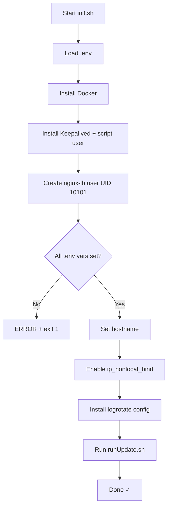

# `init.sh` — Vienkartinis inicializacijos skriptas

> **Paskirtis:** Paruošti švarų Linux serverį į pilnai veikiantį CyberArk apkrovos balansavimo mazgą (primary arba backup). Šis skriptas skirtas paleisti **vieną kartą** kiekviename serveryje.

---

## Pilnas šaltinio kodas

```bash
#!/bin/env bash

set -e

# Load environment variables
set -a
source "$(dirname "$0")/.env"
set +a

# installing docker:
curl -fsSL https://get.docker.com | sh
sudo usermod -aG docker $USER

# install keepalived
sudo apt install -y keepalived
sudo useradd -r -s /sbin/nologin keepalived_script 2>/dev/null || true

# Create a dedicated user for the nginx container
sudo groupadd -g 10101 nginx-lb 2>/dev/null || true
sudo useradd -r -u 10101 -g 10101 -s /sbin/nologin nginx-lb 2>/dev/null || true

# Validate .env variables
for var in NODE_ROLE DATAPLANE_VIP DATAPLANE_IP_PRIMARY DATAPLANE_IP_BACKUP \
           PVWA_UPSTREAM_1 PVWA_UPSTREAM_2 PSM_UPSTREAM_1 PSM_UPSTREAM_2 \
           PSMP_UPSTREAM_1 PSMP_UPSTREAM_2; do
    if [ -z "${!var}" ]; then
        echo "ERROR: $var is not set in .env"
        exit 1
    fi
done

# Set hostname based on node role
case "$NODE_ROLE" in
  primary) sudo hostnamectl set-hostname cyberark-lb-primary ;;
  backup)  sudo hostnamectl set-hostname cyberark-lb-backup  ;;
  *)
    echo "ERROR: NODE_ROLE must be 'primary' or 'backup' in .env"
    exit 1
    ;;
esac

# Allow Docker to bind to the VIP even if this node is currently the BACKUP
sudo sysctl -w net.ipv4.ip_nonlocal_bind=1
grep -q 'net.ipv4.ip_nonlocal_bind=1' /etc/sysctl.conf || \
    echo "net.ipv4.ip_nonlocal_bind=1" | sudo tee -a /etc/sysctl.conf > /dev/null

# Install logrotate configuration
sudo cp "$(pwd)/cyberark-nginx" /etc/logrotate.d/cyberark-nginx
sudo chmod 644 /etc/logrotate.d/cyberark-nginx
sudo chown root:root /etc/logrotate.d/cyberark-nginx

# Render configs and start services
chmod +x ./runUpdate.sh
./runUpdate.sh
```

---

## Eilutė po eilutės aprašymas

### Shebang ir klaidų apdorojimas

```bash
#!/bin/env bash
set -e
```

| Eilutė | Ką daro |
|---|---|
| `#!/bin/env bash` | Naudoja env tipo shebang, todėl `bash` yra randamas per `$PATH`, o ne užkoduotas tiesiogiai. |
| `set -e` | **Sustabdyti pirmoje klaidoje.** Bet kuri komanda, grąžinanti ne nulinį exit kodą, iškart nutrauks skriptą. Tai apsaugo nuo dalinės inicializacijos. |

---

### Aplinkos kintamųjų užkrovimas

```bash
set -a
source "$(dirname "$0")/.env"
set +a
```

| Eilutė | Ką daro |
|---|---|
| `set -a` | Įjungia **automatinio eksportavimo režimą** — kiekvienas priskirtas kintamasis nuo šiol yra automatiškai `export`uojamas į aplinką. |
| `source "$(dirname "$0")/.env"` | Nuskaito `.env` failą, esantį **tame pačiame kataloge kaip skriptas** (nebūtinai dabartiniame darbo kataloge). `dirname "$0"` nustato skripto katalogą. Visos raktų-reikšmių poros tampa aplinkos kintamaisiais. |
| `set +a` | **Išjungia** automatinio eksportavimo režimą, kad vėlesni kintamųjų priskyrimai nebūtų eksportuojami. |

**Kodėl tai reikalinga?** Čia užkrauti kintamieji (`NODE_ROLE`, `DATAPLANE_VIP`, upstream IP adresai ir kt.) yra naudojami validacijos bloke žemiau, `envsubst` komandoje `runUpdate.sh` viduje ir `docker-compose.yml` faile.

---

### Docker diegimas

```bash
curl -fsSL https://get.docker.com | sh
sudo usermod -aG docker $USER
```

| Eilutė | Ką daro |
|---|---|
| `curl -fsSL https://get.docker.com \| sh` | Atsisiunčia oficialų Docker diegimo skriptą ir perduoda jį `sh`. Vėliavėlės reiškia: `-f` tyliai nepavykus HTTP užklausai, `-s` tylus režimas, `-S` rodyti klaidas net tyliu režimu, `-L` sekti peradresavimus. |
| `sudo usermod -aG docker $USER` | Prideda **dabartinį vartotoją** prie `docker` grupės, kad ateityje galėtų vykdyti Docker komandas be `sudo`. (Pastaba: reikia iš naujo prisijungti, kad tai įsigaliotų.) |

---

### Keepalived diegimas

```bash
sudo apt install -y keepalived
sudo useradd -r -s /sbin/nologin keepalived_script 2>/dev/null || true
```

| Eilutė | Ką daro |
|---|---|
| `sudo apt install -y keepalived` | Įdiegia Keepalived paketą naudojant APT. `-y` automatiškai patvirtina diegimą. |
| `sudo useradd -r -s /sbin/nologin keepalived_script 2>/dev/null \|\| true` | Sukuria **sisteminį vartotoją** (`-r`) pavadinimu `keepalived_script` be prisijungimo shell. Šis vartotojas nurodomas `keepalived.conf` kaip `script_user` — sveikatos tikrinimo skriptas veikia šiuo neprivilegijuotu vartotoju saugumo sumetimais. `2>/dev/null \|\| true` užslopina klaidą, jei vartotojas jau egzistuoja, ir neleidžia `set -e` nutraukti skripto. |

---

### Nginx konteinerio vartotojo kūrimas

```bash
sudo groupadd -g 10101 nginx-lb 2>/dev/null || true
sudo useradd -r -u 10101 -g 10101 -s /sbin/nologin nginx-lb 2>/dev/null || true
```

| Eilutė | Ką daro |
|---|---|
| `groupadd -g 10101 nginx-lb` | Sukuria sisteminę grupę su GID **10101**. |
| `useradd -r -u 10101 -g 10101 -s /sbin/nologin nginx-lb` | Sukuria sisteminį vartotoją su UID **10101**, priklausantį aukščiau sukurtai grupei. |

**Kodėl UID 10101?** Oficialus Nginx Docker atvaizdas (image) naudoja UID 101, kuris Debian/Ubuntu sistemose konfliktuoja su `messagebus` sisteminiu vartotoju. UID 10101 naudojimas išvengia šio konflikto. `docker-compose.yml` paleidžia konteinerį kaip `user: "10101:10101"`, o log/cache katalogai priklauso šiam UID.

---

### Aplinkos kintamųjų validacija

```bash
for var in NODE_ROLE DATAPLANE_VIP DATAPLANE_IP_PRIMARY DATAPLANE_IP_BACKUP \
           PVWA_UPSTREAM_1 PVWA_UPSTREAM_2 PSM_UPSTREAM_1 PSM_UPSTREAM_2 \
           PSMP_UPSTREAM_1 PSMP_UPSTREAM_2; do
    if [ -z "${!var}" ]; then
        echo "ERROR: $var is not set in .env"
        exit 1
    fi
done
```

| Elementas | Ką daro |
|---|---|
| `for var in ...` | Iteruoja per visus privalomus kintamųjų pavadinimus. |
| `${!var}` | **Netiesioginis išplėtimas** — įvertina kintamąjį, kurio pavadinimas saugomas `$var`. Pavyzdžiui, kai `var=NODE_ROLE`, `${!var}` išplečiamas į `$NODE_ROLE` reikšmę. |
| `-z` testas | Grąžina true, jei kintamojo reikšmė yra **tuščia eilutė** (t.y. nebuvo nustatytas `.env` faile). |
| `exit 1` | Nutraukia su ne nuliniu exit kodu, kad operatorius tiksliai žinotų, kuris kintamasis trūksta. |

Tai yra **greito atsitraukimo apsauga** (fail-fast): jei bet kuris privalomas kintamasis trūksta, skriptas sustoja prieš atliekant bet kokius sistemos pakeitimus.

---

### Hostname nustatymas

```bash
case "$NODE_ROLE" in
  primary) sudo hostnamectl set-hostname cyberark-lb-primary ;;
  backup)  sudo hostnamectl set-hostname cyberark-lb-backup  ;;
  *)
    echo "ERROR: NODE_ROLE must be 'primary' or 'backup' in .env"
    exit 1
    ;;
esac
```

| Elementas | Ką daro |
|---|---|
| `case "$NODE_ROLE" in` | Šablono atitikimo tikrinimas pagal mazgo rolės reikšmę. |
| `hostnamectl set-hostname ...` | Nustato sistemos hostname visam laikui. Palengvina mazgo identifikavimą prisijungus per SSH. |
| `*) ... exit 1` | Universalus gaudytojas: jei `NODE_ROLE` nėra nei `primary`, nei `backup`, skriptas nutraukiamas su klaida. |

---

### Non-Local Bind įjungimas

```bash
sudo sysctl -w net.ipv4.ip_nonlocal_bind=1
grep -q 'net.ipv4.ip_nonlocal_bind=1' /etc/sysctl.conf || \
    echo "net.ipv4.ip_nonlocal_bind=1" | sudo tee -a /etc/sysctl.conf > /dev/null
```

| Eilutė | Ką daro |
|---|---|
| `sysctl -w net.ipv4.ip_nonlocal_bind=1` | **Nedelsiant** leidžia procesams prisirišti prie IP adresų, kurie (dar) nėra priskirti jokiai vietinei sąsajai. Tai labai svarbu, nes Docker konteineris prisiriša prie VIP, bet VIP egzistuoja tik tame mazge, kuris jį šiuo metu turi. Be šio nustatymo Docker atsisakytų startuoti backup mazge. |
| `grep -q ... \|\| echo ...` | Padaro nustatymą **pastovų** per perkrovimus, pridedant jį prie `/etc/sysctl.conf` — bet tik jei jo ten dar nėra (idempotentiškai). |

---

### Logrotate konfigūracijos diegimas

```bash
sudo cp "$(pwd)/cyberark-nginx" /etc/logrotate.d/cyberark-nginx
sudo chmod 644 /etc/logrotate.d/cyberark-nginx
sudo chown root:root /etc/logrotate.d/cyberark-nginx
```

| Eilutė | Ką daro |
|---|---|
| `cp ... /etc/logrotate.d/` | Nukopijuoja logrotate konfigūracijos fragmentą (`cyberark-nginx` failą) į sistemos logrotate drop-in katalogą. |
| `chmod 644` | Nustato skaitymo/rašymo teises savininkui, tik skaitymo teises grupei ir kitiems — standartinės logrotate konfigūracijų teisės. |
| `chown root:root` | Užtikrina, kad savininkas yra `root:root`, ko reikalauja logrotate. |

---

### Perdavimas `runUpdate.sh` skriptui

```bash
chmod +x ./runUpdate.sh
./runUpdate.sh
```

| Eilutė | Ką daro |
|---|---|
| `chmod +x` | Užtikrina, kad atnaujinimo skriptas yra vykdomas. |
| `./runUpdate.sh` | Perduoda faktinį konfigūracijų generavimą ir paslaugų paleidimą `runUpdate.sh` skriptui. Žiūrėkite [runUpdate.sh dokumentaciją](runupdate-sh.md) dėl detalių. |

---

## Vykdymo eigos schema


