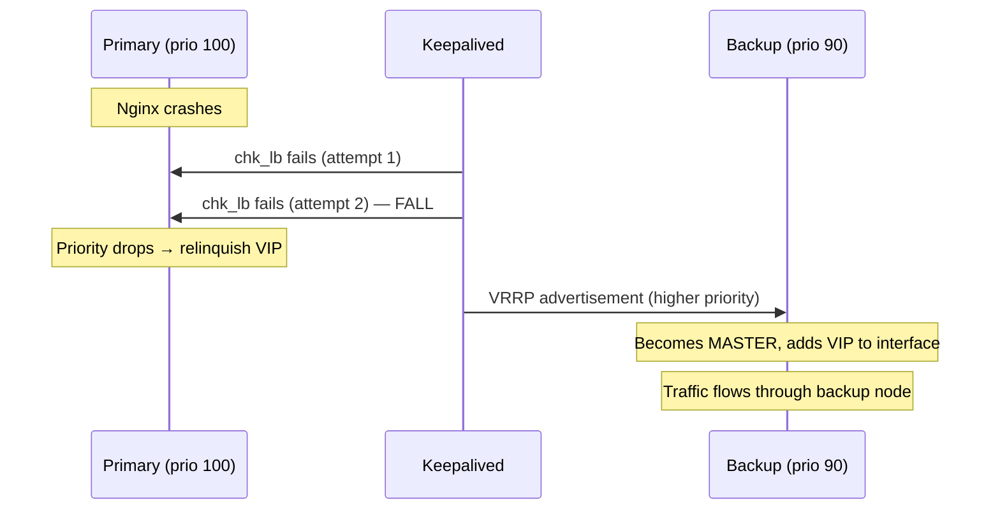

# Keepalived konfigūracija — Primary ir Backup

> **Paskirtis:** Keepalived valdo **virtualų IP (VIP)**, bendrą tarp dviejų mazgų, naudodamas VRRP (Virtual Router Redundancy Protocol). Jei aktyvaus mazgo Nginx sveikatos patikrinimas nepavyksta, VIP automatiškai perkeliamas į kitą mazgą.

---

## Architektūra

```
┌──────────────────────┐       VRRP (unicast)       ┌──────────────────────┐
│   Primary Node       │ ◄────────────────────────► │   Backup Node        │
│   priority: 100      │                            │   priority: 90       │
│   state: BACKUP      │                            │   state: BACKUP      │
│                      │                            │                      │
│   VIP: laikomas čia  │  ── esant klaidai ──►      │   VIP: perkeliamas   │
│   kai sveikas        │                            │   čia                │
└──────────────────────┘                            └──────────────────────┘
```

> **Abu** mazgai startuoja kaip `state BACKUP` su `nopreempt`. Mazgas su aukštesniu prioritetu laimi pradinę rinkimą. Tai apsaugo nuo „split-brain" ir nereikalingo VIP mėtymo.

---

## `keepalived.conf.primary` — Detalus aprašymas

### Globalūs apibrėžimai

```
global_defs {
    vrrp_strict off
    enable_script_security
    script_user keepalived_script
}
```

| Direktyva | Ką daro |
|---|---|
| `vrrp_strict off` | Išjungia griežtą VRRP atitikties režimą. Griežtas režimas blokuoja tokias funkcijas kaip unicast peers, kurias ši konfigūracija naudoja. |
| `enable_script_security` | Leidžia vykdyti tik tuos skriptus, kurie priklauso root arba sukonfigūruotam `script_user`, apsaugant nuo privilegijų eskalavimo. |
| `script_user keepalived_script` | Sveikatos tikrinimo skriptas veikia kaip neprivilegijuotas `keepalived_script` vartotojas (sukurtas `init.sh`). |

### Sveikatos tikrinimo skriptas

```
vrrp_script chk_lb {
    script "/usr/bin/nc -zvw 1 172.20.0.10 8443"
    timeout 2
    interval 3
    fall 2
    rise 2
}
```

| Direktyva | Ką daro |
|---|---|
| `script "..."` | Paleidžia `nc` (netcat), kad bandytų TCP jungtį prie Nginx konteinerio adresu `172.20.0.10:8443`. Tai yra Docker bridge tinklo konteinerio IP. `-z` tik skenavimas (be duomenų), `-v` išsamus režimas, `-w 1` laiko limitas po 1 sekundės. |
| `timeout 2` | Jei skriptas neatsako per **2 sekundes**, jis laikomas nepavykusiu. |
| `interval 3` | Vykdyti sveikatos tikrinimą kas **3 sekundes**. |
| `fall 2` | Pažymėti paslaugą kaip **neveikiančią** po **2 nesėkmių iš eilės** (= 6 sekundės). |
| `rise 2` | Pažymėti paslaugą kaip **veikiančią** po **2 sėkmių iš eilės** (= 6 sekundės). |

**Kodėl jungtis 8443?** Jungtis 8443 yra PVWA klausytojas konteinerio viduje. Jei Nginx yra sveikas ir priima jungtis, jungtis 8443 atsakys į TCP rankos paspaudimą (handshake).

**Kodėl 172.20.0.10?** Tai yra statinis IP, priskirtas Nginx konteineriui Docker bridge tinkle (apibrėžtas `docker-compose.yml`). Sveikatos tikrinimas vykdomas serveryje, pasiekiant konteinerio tinklą.

### VRRP instancija

```
vrrp_instance VI_1 {
    state BACKUP
    interface eth0
    virtual_router_id 69
    priority 100
    nopreempt

    unicast_src_ip ${DATAPLANE_IP_PRIMARY}
    unicast_peer {
        ${DATAPLANE_IP_BACKUP}
    }

    track_script {
        chk_lb
    }

    virtual_ipaddress {
        ${DATAPLANE_VIP}/24
    }
}
```

| Direktyva | Ką daro |
|---|---|
| `state BACKUP` | Pradinė būsena. Abu mazgai startuoja kaip BACKUP ir renka master pagal prioritetą. Tai saugiau nei pradėti vieną kaip MASTER. |
| `interface eth0` | Tinklo sąsaja, kurioje bus pridėtas VIP. Pakeiskite, jei jūsų data-plane sąsaja turi kitą pavadinimą (pvz., `ens192`). |
| `virtual_router_id 69` | Unikalus šios VRRP grupės identifikatorius. Abu mazgai **privalo** naudoti tą patį ID. Turi būti unikalus L2 segmente (1–255). |
| `priority 100` | **Primary** gauna 100, **backup** gauna 90. Aukštesnis prioritetas laimi rinkimus. |
| `nopreempt` | Kai mazgas tampa master, jis **lieka** master net jei originalus primary atsigauna. Apsaugo nuo VIP mėtymo. Reikalauja, kad abu mazgai startuotų kaip `state BACKUP`. |
| `unicast_src_ip` | Šio mazgo tikrasis IP VRRP komunikacijai. |
| `unicast_peer { ... }` | Kito mazgo tikrasis IP. Naudojant **unicast** vietoj multicast išvengiama problemų debesų tinkluose, kurie blokuoja multicast. |
| `track_script { chk_lb }` | Susieja VRRP instanciją su sveikatos tikrinimu. Jei `chk_lb` nepavyksta, šio mazgo efektyvus prioritetas nukrenta iki 0, sukeldamas failover. |
| `virtual_ipaddress { ... }` | VIP, kurį Keepalived valdo. Pridedamas prie sąsajos, kai šis mazgas yra master, pašalinamas, kai jis yra backup. |

---

## `keepalived.conf.backup` — Skirtumai

Backup šablonas yra beveik identiškas su šiais pagrindiniais skirtumais:

| Direktyva | Primary | Backup |
|---|---|---|
| `priority` | `100` | `90` |
| `unicast_src_ip` | `${DATAPLANE_IP_PRIMARY}` | `${DATAPLANE_IP_BACKUP}` |
| `unicast_peer` | `${DATAPLANE_IP_BACKUP}` | `${DATAPLANE_IP_PRIMARY}` |

Visa kita (global_defs, vrrp_script, virtual_router_id, nopreempt, track_script, virtual_ipaddress) yra identiška.

---

## Failover laiko juosta



**Bendras failover laikas:** ~6–9 sekundės (2 × 3 s intervalas dėl `fall 2`, plius VRRP skelbimo vėlinimas).

---

## Pritaikymo pastabos

- **Sąsajos pavadinimas**: Jei jūsų serveris naudoja `ens192`, `ens160` ar kitą pavadinimą vietoj `eth0`, turite redaguoti abu `keepalived.conf.primary` ir `keepalived.conf.backup` šablonus.
- **Virtual Router ID**: Turi sutapti abiejuose mazguose. Keiskite nuo `69` tik jei yra konfliktas su kita VRRP grupe tame pačiame tinklo segmente.
