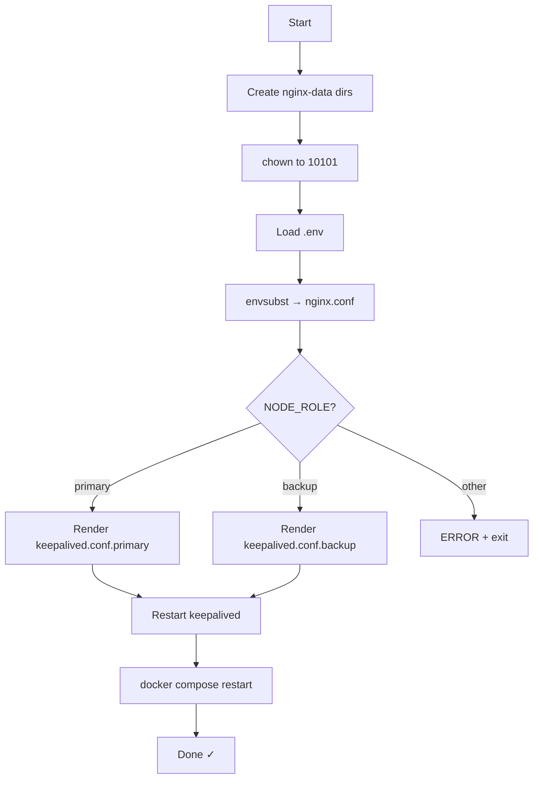

# `runUpdate.sh` — Konfigūracijų generavimas ir paslaugų perkrovimas

> **Paskirtis:** Pergeneruoti Nginx ir Keepalived konfigūracijos failus iš šablonų naudojant dabartines `.env` reikšmes, tada perkrauti abi paslaugas. Idempotentiškas ir saugus paleisti pakartotinai.

## Kada naudoti

- Pakeitus bet kokią reikšmę `.env` faile (upstream IP, VIP, mazgo rolė)
- Po repo pakeitimų, kurie modifikuoja šablonus
- Automatiškai iškviečiamas `init.sh` pirmo diegimo metu

---

## Eilutė po eilutės aprašymas

### Katalogų paruošimas

```bash
mkdir -p $(pwd)/nginx-data/logs $(pwd)/nginx-data/cache
sudo chown -R 10101:10101 $(pwd)/nginx-data
```

- Sukuria log ir cache katalogus, kuriuos Nginx konteineris montuoja kaip volumes
- Nustato nuosavybę UID/GID 10101 (`nginx-lb` vartotojui, kuriuo veikia konteineris)
- Patalpinta prieš `set -e`, kad klaida čia nenutrauktų skripto

### Skripto katalogo nustatymas

```bash
SCRIPT_DIR="$(cd "$(dirname "$0")" && pwd)"
```

- Nustato **absoliutų kelią** iki katalogo, kuriame yra šis skriptas
- Užtikrina, kad skriptas veiks nepriklausomai nuo kviečiančiojo darbinio katalogo

### Aplinkos kintamųjų užkrovimas

```bash
set -a; source "$SCRIPT_DIR/.env"; set +a
```

- `set -a` automatiškai eksportuoja visus priskirtus kintamuosius, kad `envsubst` galėtų juos pasiekti
- Nuskaito `.env` iš paties skripto katalogo
- `set +a` išjungia automatinį eksportavimą

### `nginx.conf` generavimas

```bash
envsubst '${PVWA_UPSTREAM_1} ${PVWA_UPSTREAM_2} ${PSM_UPSTREAM_1} ${PSM_UPSTREAM_2} ${PSMP_UPSTREAM_1} ${PSMP_UPSTREAM_2}' \
    < "$SCRIPT_DIR/nginx.conf.template" > "$SCRIPT_DIR/nginx.conf"
```

- `envsubst` pakeičia **tik** išvardintus kintamuosius — aiškus sąrašas apsaugo nuo Nginx vidinių kintamųjų (`$remote_addr` ir pan.) sugadinimo
- Nuskaito `nginx.conf.template`, įrašo sugeneruotą rezultatą į `nginx.conf`

### `keepalived.conf` generavimas

```bash
case "$NODE_ROLE" in
  primary) envsubst ... < keepalived.conf.primary | sudo tee /etc/keepalived/keepalived.conf ;;
  backup)  envsubst ... < keepalived.conf.backup  | sudo tee /etc/keepalived/keepalived.conf ;;
esac
```

- Parenka teisingą šabloną pagal `NODE_ROLE` (primary turi prioritetą 100, backup — 90)
- Pakeičia `${DATAPLANE_VIP}`, `${DATAPLANE_IP_PRIMARY}`, `${DATAPLANE_IP_BACKUP}`
- Įrašo į `/etc/keepalived/keepalived.conf` per `sudo tee`

### Paslaugų perkrovimas

```bash
sudo systemctl restart keepalived
sudo docker compose down && sudo docker compose up -d
```

- Perkrauna Keepalived, kad pritaikytų naują konfigūraciją
- Sustabdo ir iš naujo sukuria Nginx konteinerį su atnaujintu `nginx.conf`

---

## Eigos diagrama


